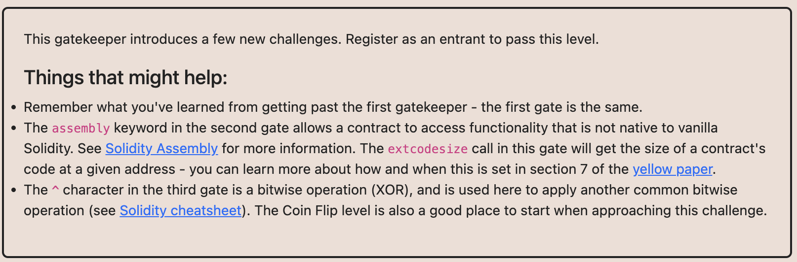

# Ethernaut Foundry로 풀기

## 14.Gatekeeper Two ***



조건이 세가지가 있다.

1.gateOne
=> 컨트랙트 통해서 해결

2.gateTwo
=> assembly에서 extcodesize(caller())가 0이 되어야함.
=> 그러기 위해서는 constructor를 통해서 컨트랙트가 생성되기전?에 실행하면된다.

3.gateThree

```
    modifier gateThree(bytes8 _gateKey) {
        require(uint64(bytes8(keccak256(abi.encodePacked(msg.sender)))) ^ uint64(_gateKey) == type(uint64).max);
        _;
    }
```

조건 통과를 하려면 ^ 를 알아야하는데 bitwise연산중에서 XOR연산이고
대응되는게 다르면 1을 반환하는 것.

uint64(bytes8(keccak256(abi.encodePacked(msg.sender))) => 12576243794637496058
type(uint64).max => 18446744073709551615

이 두개를 이진수로 비교해서 \_gateKey를 구하면 된다.

1010111010000111110010110001100101110100000101000001111011111010
0101000101111000001101001110011010001011111010111110000100000101 // => 0x517834E68BEBE105
1111111111111111111111111111111111111111111111111111111111111111

그런데 여기서 msg.sender가 컨트랙트주소가 된다. 따라서
(uint64(bytes8(keccak256(abi.encodePacked(msg.sender)))) ^ uint64(\_gateKey) == type(uint64).max)
여기에서 gateKey를 구하려면 반대로
(uint64(bytes8(keccak256(abi.encodePacked(msg.sender)))) ^ type(uint64).max 를 하면 나오기 때문에 constructor에서
위 값을 구해서 gateKey로 넣어준다.
