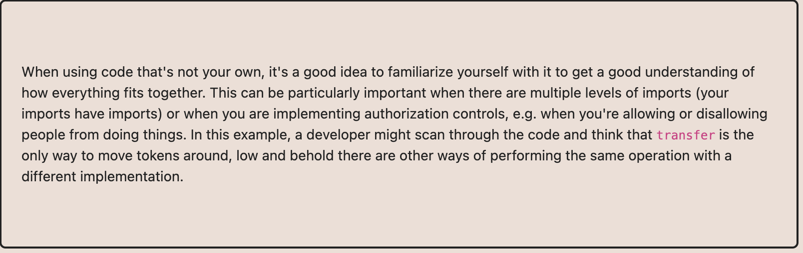

# Ethernaut Foundry로 풀기

## 15.Naught Coin

msg.sender == player 이거만 체크하니까 컨트랙트 통해서 transfer를 실행하면 
빠져나갈수있을듯. 
transfer에서 컨트랙트에서 못보내니까 
transferFrom은 ERC20을 상속받아서 있음. 
그걸 사용. 
나한테 approve준다음에 transferFrom하면 됨. 
