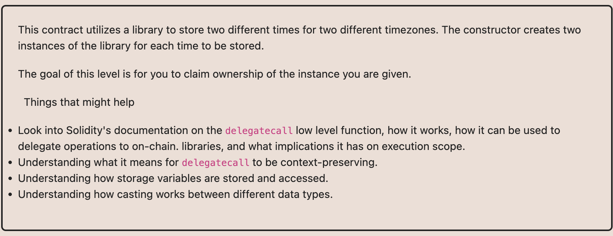

# Ethernaut Foundry로 풀기

## 16.Preservation

오너쉽 가져오기

오너가 세번째 slot에 있는데 
delegatecall을 이용하면 proxy의 storage를 건드리니까 그거 이용하면 될듯. 

처음 setFisrtTime으로 timeZone1Library를 공격컨트랙로 바꾼다음에
다시 setFisrtTime을 실행해서 내 주소로 owner로 바꾼다. 