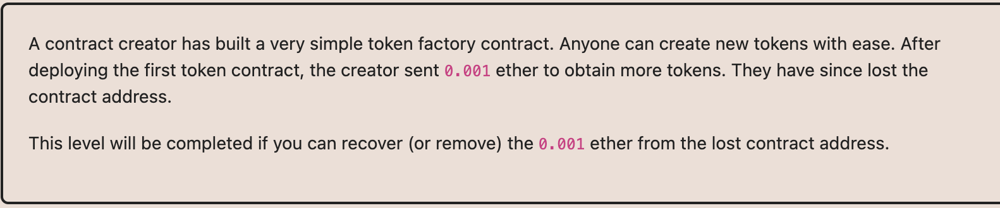

# Ethernaut Foundry로 풀기

## 17.Receovery ***




스캐너에서 token주소를 찾은 다음에 destory()실행. 

이더스캔에서 찾는 방법 말고 
```
        address lostcontract = address(
            uint160(
                uint256(
                    keccak256(
                        abi.encodePacked(
                            bytes1(0xd6),
                            bytes1(0x94),
                            address(0x951636ADcB3BFDE80fEB9aA2f71094Bb73CB1817), 
                            // 0x951636ADcB3BFDE80fEB9aA2f71094Bb73CB1817 => level주소 
                            bytes1(0x01)
                        )
                    )
                )
            )
        );
```
를 통해서 Token컨트랙트를 찾을 수도있다. 

레퍼런스1 : https://blog.dixitaditya.com/ethernaut-level-17-recovery
레퍼런스2 : https://medium.com/blockchain-nft/rlp-%EC%9D%B8%EC%BD%94%EB%94%A9-350c78c8b15b 
