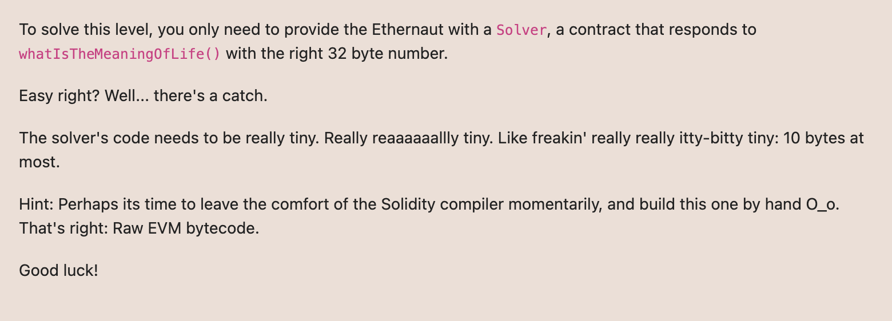

# Ethernaut Foundry로 풀기

## 18. MagicNumber ***




solver 컨트랙트를 만들어서 제시하면 됨. 
whatIsTheMeaningOfLife() 함수가 정확한 32bytes 숫자를 반환하면 됨. 
조건1. 컨트랙트트 10bytes 미만 
조건2. solidity말고 evm bytes코드 사용.

처음에 솔리디티로 코드 작성 
```
    function whatIsTheMeaningOfLife() external pure returns (uint256) {
        return 42;
    }
```
위 코드 Decode에서 보니까 아래와같이 나오는거같음 
```
    opcode  
    =>
    PUSH1 0x33
    PUSH1 0x47
    JUMP 
    JUMPDEST
    PUSH1 0x00
    PUSH1 0x2a
    SWAP1 
    POP
    SWAP1
    => 이것보다 더 간단하게 해야함. 
```

    PUSH1 0x2a  [ 0x2a ]
    PUSH1 0x00  [ 0x00, 0x2a ]
    MSTORE 
    PUSH1 0x20 
    PUSH1 0x00
    RETURN

    602a
    6000
    52
    6020
    6000
    f3

    602a60005260206000f3   => 이거는 0000..42를 리턴하는 opcode (앞에 0 패딩이붙은)
    //000000000000000000000000000000000000000000000000000000000000002a
    //offset 0부터 32bytes

    602a6000526001601Ff3   => 이게 42를 리턴하는 opcode 
    //offset 31부터 1bytes

    

    그러면 저거를 이제 return해주는 opcode를 작성 

    PUSH10 602a6000526001601Ff3
    PUSH1 0x00
    MSTORE  여기까지하면 00000000000000000000000000000000000000000000602a6000526001601Ff3
    PUSH1 0x0a => 10bytes
    PUSH1 0x16  => 16 => 22bytes
    RETURN

    602a6000526001601Ff3
    6000
    52
    600a
    6016
    f3

    22bytes부터 10bytes를 리턴 
    69602a6000526001601Ff3600052600a6016f3   => 2a

    69602a60005260206000f3600052600a6016f3   => 000000000000000000000000000000000000000000000000000000000000002a
    아래가 정답


레퍼런스1 : https://metana.io/blog/ethernaut-level-18-walkthrough-magic-number/
