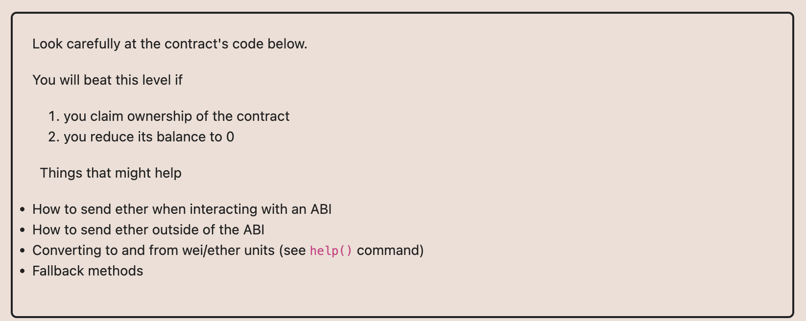

# Ethernaut Foundry로 풀기

## 01.Fallback

[참조](https://medium.com/@JohnnyTime/ethernaut-ctf-fallback-challenge-1-foundry-solution-2023-5382f5890151)해서 시작

코드를 보면 처음에 조금 보낸다음 receive함수가 있으니까
컨트랙트로 이더를 보내서 owner가져온다음에 실행하면 끝.
