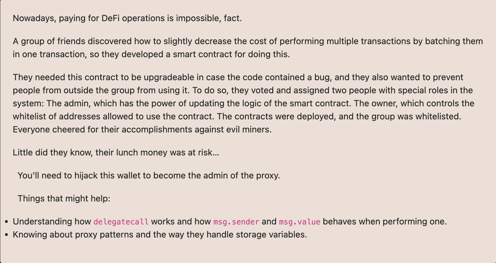

# Ethernaut Foundry로 풀기

## 24. Puzzle Wallet

PuzzleProxy랑 PuzzleWallet이게 어떤구조로 얽혀있는지 모르겠음.
아마도 코드를 공개하지 않은거같은데 ..
puzzlWallet owner()를 불러보면 contract address가 뜸.

instance로 나온 주소는 puzzleWallet

PuzzleProxy.admin가져오면 됨

아마도.

puzzleWallet에 돈있는거 빼서 owner부터 바꿔야함.
0.01 ether 안에있음. 음 다른거하려니까 다 onlyWhitelisted 이거 걸려있음
Attack에서 puzzleWallet.deposit() 우선 한번한다음에
Execute이용해서 multi call 날려서 공격컨트랙트에서 owner slot을 이용해서 puzzleWallet의 owner를 변경

proxy인지 체크하는 법 0x360894a13ba1a3210667c828492db98dca3e2076cc3735a920a3ca505d382bbc 에 저장되어있는 impl이 있는지 확인한다.
cast storage 0x647f11a425C2ef864955Ea26D0e9cE5c3936A86f 0x360894a13ba1a3210667c828492db98dca3e2076cc3735a920a3ca505d382bbc
하니까
0x0000000000000000000000005e7a6ee07d662714b2fc46954c8ea6164d6b44a1
나옴.

따라서.
0x647f11a425C2ef864955Ea26D0e9cE5c3936A86f는
0x5e7a6ee07d662714b2fc46954c8ea6164d6b44a1를 impl로 가지고있는 proxy컨트랙트다.!

multicall 안에
한번은 그냥 deposit
한번은 execute안에 deposit을 실행하도록 ...!!!!!!!
그리고 두개 묶어서 multicall로 고고

address(this).balance == 0 를 만든다음에
setMaxBalance를 실행시키고
MaxBalacne를 0으로 만든다음
init을 실행해야한다.
