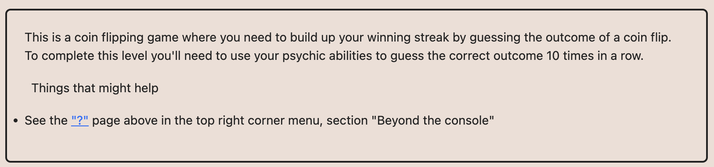

# Ethernaut Foundry로 풀기

## 03.CoinFlip



[참조](https://medium.com/@JohnnyTime/ethernaut-3-coinflip-foundry-solution-2023-b8c0725f474b)해서 시작

전에 remix를 사용해서 했을때는 어떻게 나오는지 확인한다음에 했던거같은데
어찌되었든

```
uint256 blockValue = uint256(blockhash(block.number - 1));
uint256 coinFlip = blockValue / FACTOR;
bool side = coinFlip == 1 ? true : false;
```

10번실행하면 됨. 
이 부분이 중요해서 저 부분을 바로 코드에 넣어서 어떠한 블록넘버가 오든지 처리하는게 좋은듯.
