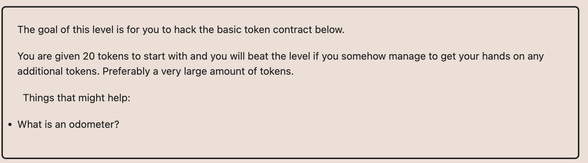

# Ethernaut Foundry로 풀기

## 05.Token

나한테 20개가 있는데 토탈서플라이 다 가져오기.
여기서 키워드는 버전인 0.6이라는 것.
0.6.0버전은 under, overflow가 자동으로 되어있지 않아서 safeMath라이브러리를 사용해줘야한다.

그래서 그냥 내가 가지고있는 것보다 많은 수를 다른주소로 transfer하면 된다.
