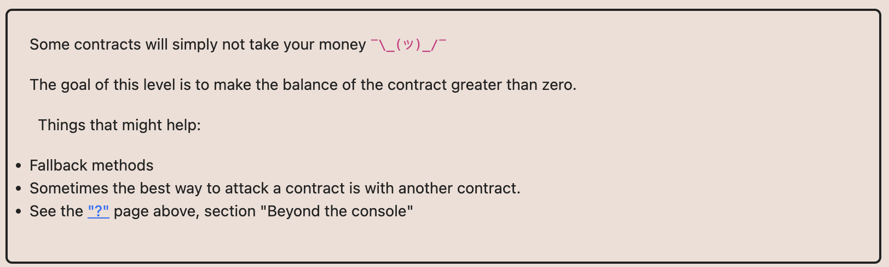
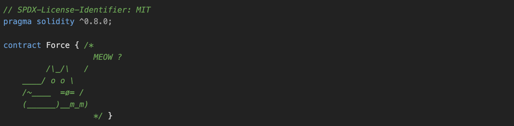

# Ethernaut Foundry로 풀기

## 07.Force



코드가 위처럼 나와있다.
컨트랙트에 돈을 보내면 되는건데 fallback을 이용하라고 힌트가 나와있다.

```
contract Attack {
    constructor(Force _forceInstance ){
     address(_forceInstance).call{value: 1 wei}("")  ;
    }
}
```

이런식으로 constructor에서 call을 통해서 이더를 보내주면 되는게 아닌가 생각했는데 아닌듯.
[참조](https://medium.com/@JohnnyTime/ethernaut-7-force-foundry-solution-2023-walkthrough-tutorial-7b78f9373ca3) => 아하 컨트랙트를 만들고 selfdestruct를 이용해서 강제로 토큰을 보내버려야한다. 그럼 끝!
