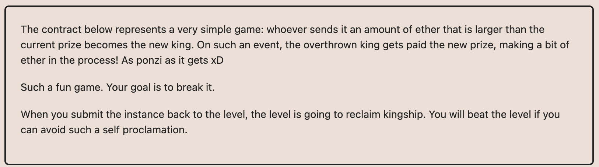

# Ethernaut Foundry로 풀기

## 09.King

간단하게 king이 내가 되면 된다.
prize를 보면 '1000000000000000'로 되어있고 저거보다 같거나 많은 수량을 보내면 된다.

+그 다음 왕이 아무도 될 수 없게 해야하는데
그렇게 하려면 `payable(king).transfer(msg.value)`가 작동하지 않아야한다.
문제 컨트랙트는 receive함수가 있어서 그게 가능했는데 receive가 없으면 이더를 못받아 king에게 transfer하는게 실패하게 된다. 따라서 receive가없는 컨트랙트를 통해서 실행해야한다.
